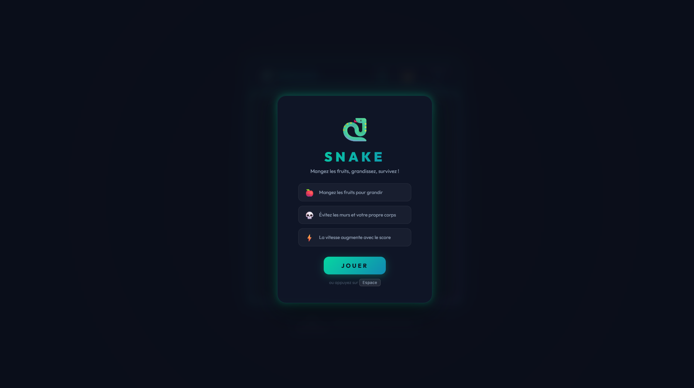
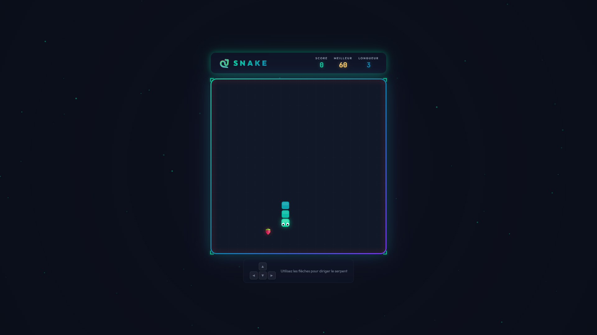
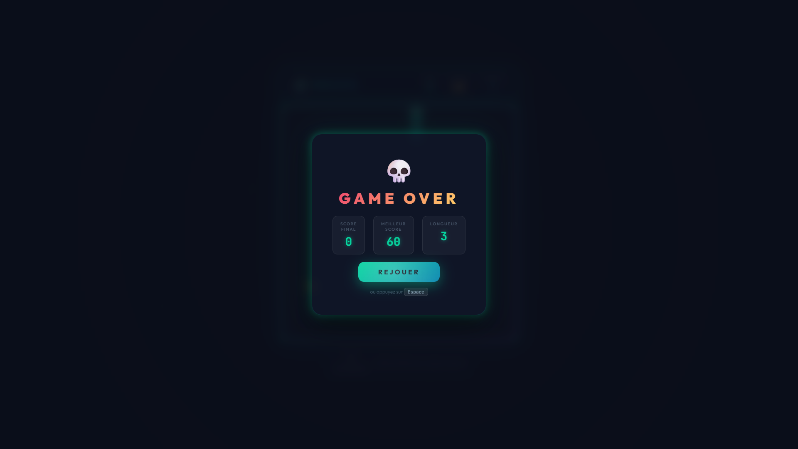

# 🐍 Snake — The Game

A modern, visually stunning Snake game built with pure **HTML**, **CSS**, and **JavaScript**. No frameworks, no dependencies — just clean code and premium aesthetics.


---

## 📖 Description

**Snake** is a classic arcade game reimagined with a premium dark neon design. Control a glowing serpent across the grid, eat fruits to grow longer, and try to survive as long as possible. The game ends instantly if the snake hits a wall or its own body — **no second chances**.

The game features a polished UI with glassmorphism panels, animated particle effects, screen shake on collisions, and a gradient-colored snake body with animated eyes that follow the direction of movement.

---

## 📸 Screenshots


<p align="center">
  
  
  
</p>


## ✨ Features

| Feature | Description |
|---|---|
| 🎮 **Arrow Key Controls** | Smooth and responsive directional movement |
| 🍎 **7 Fruit Types** | 🍎🍊🍇🍓🍑🍋🥝 — each with different point values |
| 💀 **Instant Death** | Hit a wall or your own body and it's game over |
| ⚡ **Progressive Speed** | The game gets faster with every fruit eaten |
| 🏆 **High Score** | Best score saved automatically in the browser (localStorage) |
| 💥 **Particle Explosions** | Burst of colored particles when eating a fruit |
| 📳 **Screen Shake** | Dynamic screen shake effect on collisions and death |
| 🌈 **Gradient Snake** | Body color transitions from green (head) to blue (tail) |
| 👀 **Animated Eyes** | Snake eyes follow the current direction |
| 🔴 **Danger Zones** | Red glow on borders warns you of the deadly walls |
| ✨ **Floating Particles** | Ambient background particles for atmosphere |
| 🪟 **Glassmorphism UI** | Modern frosted-glass panels with glow borders |

---

## 🎯 How to Play

1. **Open** `index.html` in any modern browser
2. Click **JOUER** or press **Space** to start
3. Use the **arrow keys** (← ↑ → ↓) to direct the snake
4. **Eat fruits** to grow longer and earn points
5. **Avoid** hitting the walls or your own body
6. Try to beat your **high score**!

### Controls

| Key | Action |
|---|---|
| `↑` | Move Up |
| `↓` | Move Down |
| `←` | Move Left |
| `→` | Move Right |
| `Space` | Start / Restart |

---

## 🎨 Design

The game uses a **dark neon theme** inspired by modern gaming aesthetics:

- **Color Palette**: Deep navy background with vibrant green (`#06d6a0`), blue (`#118ab2`), and purple (`#7c3aed`) accents
- **Typography**: [Outfit](https://fonts.google.com/specimen/Outfit) for UI and [JetBrains Mono](https://fonts.google.com/specimen/JetBrains+Mono) for scores
- **Effects**: Glassmorphism, animated gradient borders, particle systems, and glow shadows
- **Responsive**: Adapts to smaller screens with a mobile-friendly layout

---

## 🗂️ Project Structure

```
snake/
├── index.html    # Main HTML page with game layout and overlays
├── style.css     # Premium dark neon theme with animations
├── game.js       # Complete game engine (rendering, logic, particles)
└── README.md     # This file
```

---

## 🛠️ Tech Stack

- **HTML5** — Semantic structure with Canvas API
- **CSS3** — Vanilla CSS with custom properties, animations, glassmorphism, and gradients
- **JavaScript** — Pure ES6+ with no external dependencies
- **Canvas API** — Used for both the game rendering and background particle effects
- **localStorage** — For persistent high score tracking

---

## 🚀 Getting Started

No build tools or installation required. Simply:

```bash
# Clone or download the project
# Open the file in your browser
start index.html
```

Or drag and drop `index.html` into any modern browser (Chrome, Firefox, Edge, Safari).

---

## 📊 Scoring System

| Fruit | Points |
|---|---|
| 🍎 Apple | 10 |
| 🍋 Lemon | 10 |
| 🍊 Orange | 15 |
| 🍓 Strawberry | 15 |
| 🍇 Grape | 20 |
| 🍑 Peach | 25 |
| 🥝 Kiwi | 30 |

---

## 📄 License

This project is open source and available for personal and educational use.

---

<p align="center">
  Made with ❤️ and JavaScript
</p>
